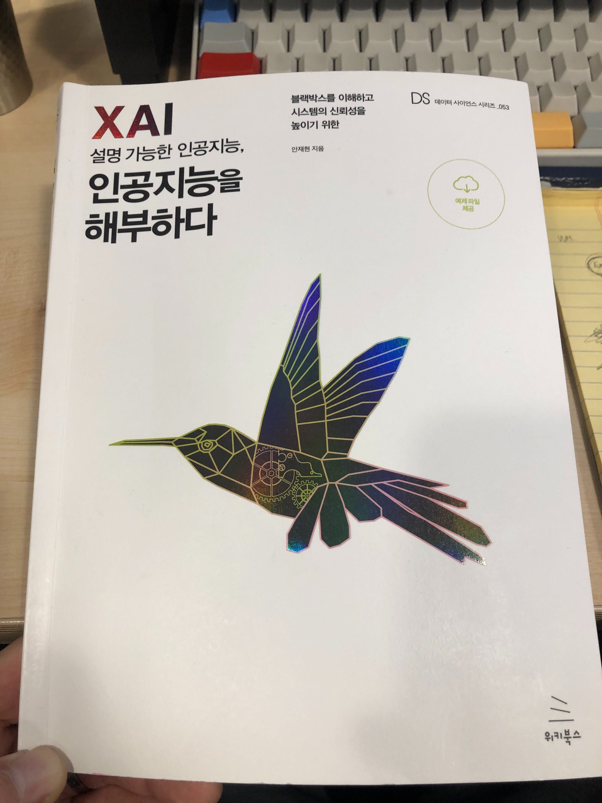

### (프)리뷰 배경

저자 안재현님은 과거 함께 일했던 데이터 사이언티스트 동료다. 현재는 넥슨코리아 인텔리전스랩스 데이터 사이언티스트로 일하고 계시다. 회사 김인기 대표에게 이 책을 선물했고, 빌려 읽게 되었다. 아직 책 전부를 읽지 못했고, 서두의 04 의사결정트리를 읽고 있음에도 리뷰를 먼저 진행하게 되었다. 이유는 스스로 저자가 얼마나 어려운 개념에 대해 쉽게 설명하는지 함께 일해봐서 알고, 또 지금까지 읽은 내용로 미루어 봤을 때, 이 책이 얼마나 나를 두근거리게 하는지에 대해 공유하고 싶었기 때문이다. 따라서 리뷰가 아닌 프리뷰라고 글의 제목을 적어 보았다.

> 저자가 얼마나 어려운 개념에 대해 쉽게 설명하는지 함께 일해봐서 알고, 또 지금까지 읽은 내용로 미루어 봤을 때, 이 책이 얼마나 나를 두근거리게 하는지에 대해 공유하고 싶었기 때문이다

학습은 대부분 온라인 강의 및 온라인 리소스로도 대체 가능하지만, 책이 좋은 이유는, 그 내용에 대한 진지함과 독자에 대한 배려때문이다. XAI라는 개념과 코드등이 나오기 전에 책은 XAI라는 용어 자체가 등장한 배경및 역사를 6페이지나 사용하여 상당히 자세히 소개한다. 그리고 심지어 이 내용이 재밌다. 어려운 공학서에서 찾아볼 수 없는 스토리텔링이고, 마치 이후 책 내용을 꼭 읽게끔 만드는 저자의 세일즈 능력인지도 모르겠다.

### XAI

우리는 머신러닝을 통해 설명하기 어렵지만 그 동안 좋은 컴퓨팅 파워로 인해 꽤 좋은 모델들을 만들어냈고 또 예측가능하게 되었다. 하지만 머신러닝이라는 개념 자체에서 볼 수 있듯이, 실제 해당 모델에 대한 개선이나 문제점을 해결하기 위해선 모델에 대해 더 잘 알아야 한다. 저자는 다음과 같이 이야기한다.

"오늘날 머신러닝은 '잘 작동한다'와 '잘 작동하지 않는다'를 평가함수(Evaluation function)를 사용해 진단한다. 그러나 평가 함수는 데이터셋 전체에 대한 일반화된 평가 결과를 제시할 뿐, 모델이 어떻게 개선돼야 하는지 직접적인 단서를 제공하지 못한다. 그러나 XAI는 모델이 구축된 후에 어떻게 데이터를 받아들이고 있는지 해설한다. 따라서 연구자들은 XAI 기법을 사용해서 모델 학습이 끝난 후에도 (결과가 좋든 안 좋든 상관없이) 더 나은 모델을 구축하기 위해 고민할 수 있다."

### 실습 환경 소개

실습 환경에 대한 자세한 소개 역시 저자의 배려가 느껴지는 부분이다. 대부분의 공학서는 이 부분에서 충분한 안내가 되지 못했던 것으로 기억한다. 그래서 별 기대치가 없었어서 신기했다. 예를 들어 텐서플로우 설치에서 아래와 같은 안내가 있다.

"... (중략) Visual C++를 설치한 이후에는 윈도우가 제한한 경로 길이 제한을 풀어줘야 한다. 윈도우 10은 기본적으로 경로 문자열을 250자로 제한하고 있다. 텐서플로 라이브러리 중 일부는 경로 문자열이 250자가 넘기 때문에 텐서플로 라이브러리를 로드하는 중에 문제가 발생할 수 있다.
윈도우 키를 누르고 `gpedit.msx`를 입력하자 ... (중략)"

대부분 책을 보고 따라 환경을 준비하다가 막힐 수 있는 내용으로, 주로 인터넷 이나 커뮤니티 등을 통해 따로 해결해야 할 수 있었던 부분을 저자는 미리 예측하고 설명한다.

### 책의 특징

#### 글의 흐름과 수식, 그림의 조화

공학서를 보면 예시 그림이나 수식등이 글이 끌고가는 흐름을 방해하거나 하는 경우가 있는데, 이 책은 글과 수식 그림의 조화가 뛰어나다. 공학서에서 이런 흐름의 조화는 나와 같이 이 주제에 대한 이해도가 낮은 독자에게 특히 도움이 된다. 그림을 보고 글로 다시 돌아간다든지, 글에서 다시 수식으로 돌아가야 한다든지 하는 글을 읽는 순서를 방해하지 않기 때문이다. 이 역시 자연스럽게 되었을까라기 보다는, 저자가 수 도없이 글의 흐름을 리뷰하고 신경썼기 때문이 아닌가 싶다.

#### 기본에 대한 충실한 소개

머신 러닝과 인공지능에 대한 숙련도가 높지 않아도, 저자는 사용되는 기본 개념들에 대해 잊지 않고 충실히 설명하고 지나간다. 마치 머신 러닝을 새로 배우는 느낌이 들 정도로 설명하고 느낄 정도인데 아마도 앞뒤 배경 설명에 대해 충실하기 때문이지 아닐까 싶다. 따라서 이 책을 읽어가며 다른 책을 다시 찾아보고 돌아오지 않아도 어렵지 않게 책을 따라갈 수 있었다.

특히 부스팅을 설명하는 과정에서 기본 원리부터 수식전개, 그리고 실제 동작과 팁까지의 설명이 매우 잘 되어있었다. 예제 코드가 대부분의 설명, 수식, 그림 이후에 나오는 순서도 좋았다. 이전 공학서에서 중간 중간 예제 코드가 너무 맥락없이 나와 개념 설명을 방해하는 것을 보았기 때문이다.

#### 모델 튜닝

이전에 간단히 모델 하이퍼파라미터 튜닝을 경험했을 때, 강의에서 안내된 내용은 해당 모델을 많이 써 보고 파라미터 값들을 이렇게 저렇게 바꿔보고 accruacy등 결과를 보라는 것이었다. 틀린 내용은 아닐테지만, 각 파라미터의 성질은 무엇인지, feature importance 및 의존성 플롯(pdp) 및 트리 시각화 등을 통해 해당 모델을 들여다보는 관찰 프로세스에 대한 강조가 없어 아쉬웠다. 저자는 이 부분에 대해 차근 차근 천천히 전개해 나간다. 마치 파이썬 노트북을 한 줄 한 줄 써가며 설명 받는 느낌이 든다.

### 결론

저자가 초반에 언급한 부분이 있는데,

> 논문을 읽다 보면 논문의 저자가 바로 옆에서 속삭이는 것처럼 배움이 전해지는 순간이 있다. 이런 순간은 자주 오지 않는다. 저자의 경험상, 이런 행운의 순간은 충분히 집중할 수 있는 시간과 논문을 읽을 만한 충분한 사전 지식, 우수한 저자와 논문 등이 한꺼번에 조화를 이룰 때 찾아오는 것 같다. 독자 여러분도 이 책을 읽고 충분한 사전 지식을 습득해서 좋은 논문을 접할 때의 전율을 느낀다는 저자의 말에 공감할 날이 오기를 고대한다.

비록, 아직 논문에서 이런 전율은 못 느꼈지만, 이 책을 읽으며 나는 저자가 옆에서 속삭이는 듯한 배움의 경험이 전해졌다. 평소에도 어떤 내용을 설명할 때 화이트보드나 노트 등을 이용해서 쉽고 재밌게 설명해주던 저자가 기억되었다. 다음 챕터인 대리 분석(Surrogate Analysis)와 필터 시각화(Filter Visualization) 내용이 기대되며, 뒤에 나오는 실전 데이터 분석에서 다루는 신용 대출 분석 역시 기대가 크다.

책을 모두 읽고 나면 후기를 다시 이 글에 붙여볼 예정이다.
