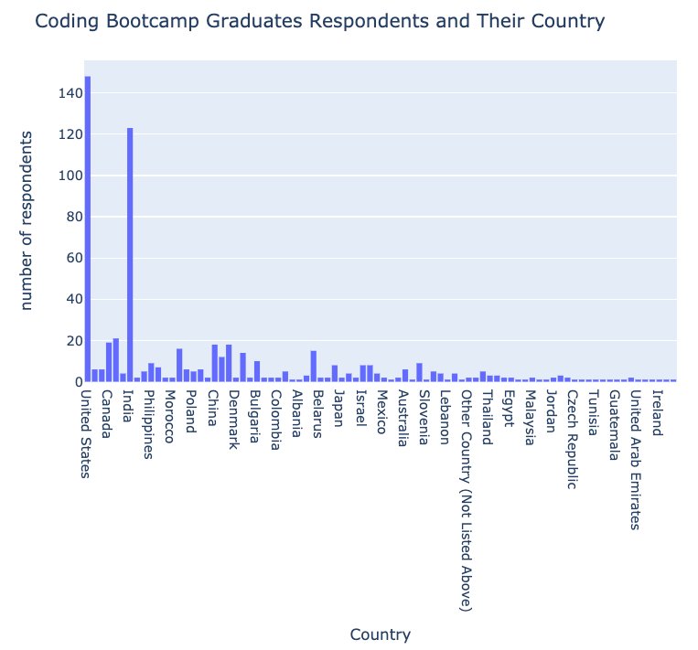
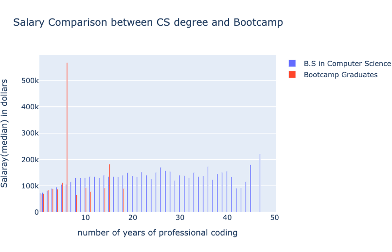
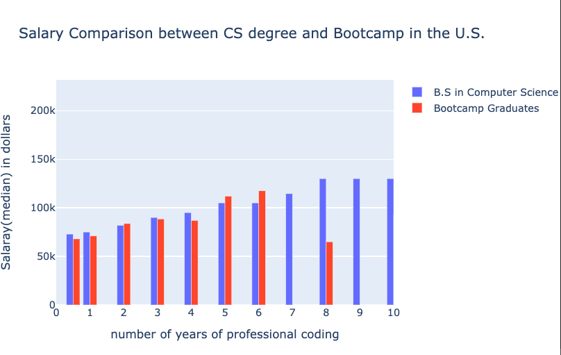
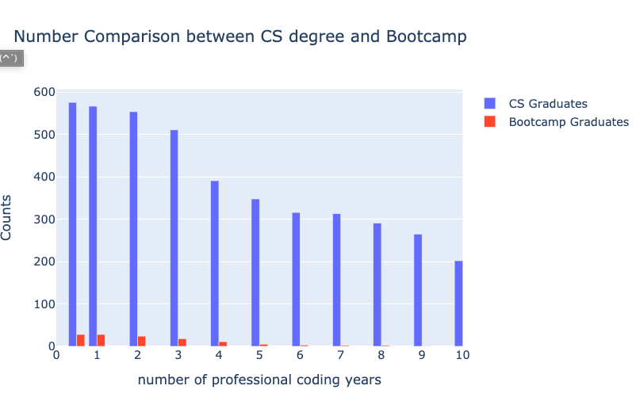
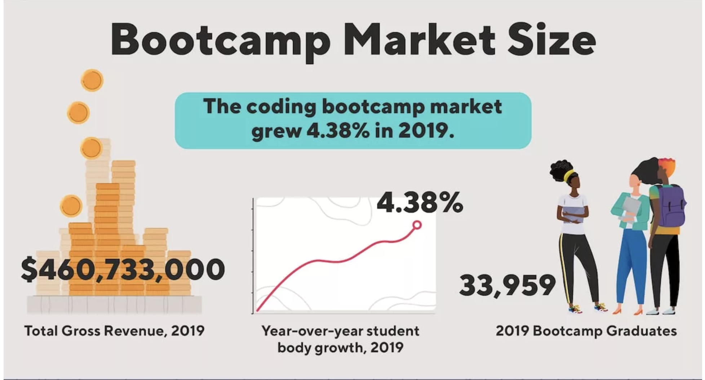

## Intro 🏃‍♂️

There are many arguments whether or not coding bootcamps 💻 are worth it.
People debate a lot in the communities <a href="https://www.reddit.com/r/webdev/comments/6tcnt9/are_coding_bootcamps_worth_the_time_and_money/" target="_blank">Reddit discussion link</a> and it is hot issue for those who want to start their new professional software engineering career.

I will not talk about pros and cons of going to bootcamp here, because there are already <a href="https://careerkarma.com/blog/are-coding-bootcamps-worth-it/" target="_blank">many discussion done out there</a>.

> In this article, I would instead talk about how much coding bootcamp are valued in the field based on <a href="https://www.kaggle.com/mchirico/stack-overflow-developer-survey-results-2019" target="_blank" style="font-weight: bold;">stackoverflow survey 2019</a> data.

#### _CATUIONS: There are some assumptions behind the analysis._

1. There are no specific educational background group with labled as `coding bootcamp` in the data but there is one like `Participated in a full-time developer training program or bootcamp` label. Therefore I would like to consider this group with addtionanl condition of years of professional coding ranging from 0 to 9 as `coding bootcamp` group based on the fact that wikipedia says the very first bootcamp was in 2001 in U.S.
2. I am looking at only the United States data becasue the majority of coding bootcamps are in the states. Apparently, India is the second largest coding bootcamp graduates, but let me focus on the states in this article.

## My Hypothesis 🔬

> The bootcamp graduates are valued as equal as B.S. degree in Computer Science in the field

## My Startegy 🗺️

In order to validate my hypothesis, I would like to compare Salaries between two different groups.

1. B.S. degree in Computer Science or similar computer related study
2. Coding Bootcamp graduates

Stackoverflow gives two columns, one with `EdLevel` where I can figure who got B.S. degree in computer science or similar. Also it gives me `EduOther` where I can filter out coding bootcamp graduates.

# Plot Result 📊

Surprisingly I have an insane salary median peak ⚠️ for bootcamp graduates at 6 years of professional coding expereience. This can't be right unless someone went to coding bootcamp years ago and he or she quickly went IPO and finally somehow he or she submitted stackoverflow survey. Also, I can assume there are not many people in that condition because it is a median value. Let's investigate what's going on here.

## Investigation 🕵️

After reading the raw records with given condition, I found 1,000,000 USD salary response at `index: 67663` respondent.

It is either

1. Again, someone whe learend programming from coding bootcamp and founded a company and went IPO 🚀 and submitted stacoverflow survey.
2. simply a digit typo.

It is fair enough to assume a typo. I removed a typo and re-plotted.

## Plot Again 📊

plot is now updatedd with fixed data.
I trimmed out years of coding prefossional more than 10 years because according to wikipedia it says the coding bootcamp has been for 9 years (the first bootcamp was in 2001 in U.S.).

### For Perspective Student Aspect 🎓

Speaking of Salary, as a perspective student, it is incorrect compare the salary you expect to get at 1st year. Why? you have to spend 4 years at college to get a job with the degree, but coding bootcamp on overage takes maximum 6 months, and say you need 6 months for job searching conservatively. You have full 3 years of salary 💵 & experience 🏃‍♂️ while C.S. degree students study in college.

#### side note

By the way, just FYI, `30 out of 148` of coding bootcamp graduates in the states responded they have either zero or null compensation. Therefore my rough calculation of hiring rate among the coding bootcamp graduates respondents are `79%`.

### For Hiriing Compnay Aspect 🤔 ➕ ➖

<h4 style="text-align: center;">Salary in median</h4>

|                   | coding bootcamp | C.S. degree |
| ----------------- | --------------- | ----------- |
| all graduates     | 84,375 USD      | 110,250 USD |
| less than 3 years | 80,000 USD      | 79,644 USD  |
| more than 3 years | 91,500 USD      | 110,250 USD |

I divided salary medians into two groups, `less than` and `more than` 3 years of coding experience. If you look at `less than 3 years` group, coding bootcamp median salary is even higher in the field. If you are a hiring manager at company, would you accept the statement below?

> "Hiring Junior SW Engineer with coding bootcamp background is not a bad choice"

I would do.

## Final Thoughts 🏁

My hypothesis was

> The bootcamp graduates are valued as equal as B.S. degree in Computer Science in the field

Based on the data analysis, I cannot reject my original hypothesis because the salary medians are pretty close between two groups from the 0-6 years of professional career years. Coding bootcamp graduates were even more valued in the field in the range of 5-6 years. However, the reason that I said `cannot reject my hypothesis`is, the popultaion of coding bootcamp graduates are significantly smaller than the other group.

Also only 0.3% among the expected bootcamp graduates populations (33,959 according to Career Karma) in U.S. responded the Stackoverflow Survey.

I found that bootcamp graduates are growing (4.38% growth in 2019) and expect it to grow more in 2020. 📈

_source: [Career Karma](https://careerkarma.com/blog/bootcamp-market-report-2020/)_

There is no point arguing which education path is better, but hope you can see some data how the industry values coding bootcamp graduates from the survey data.

you can find complete code [HERE 💾](https://github.com/johnnykoo84/DS-Unit-1-Build)
